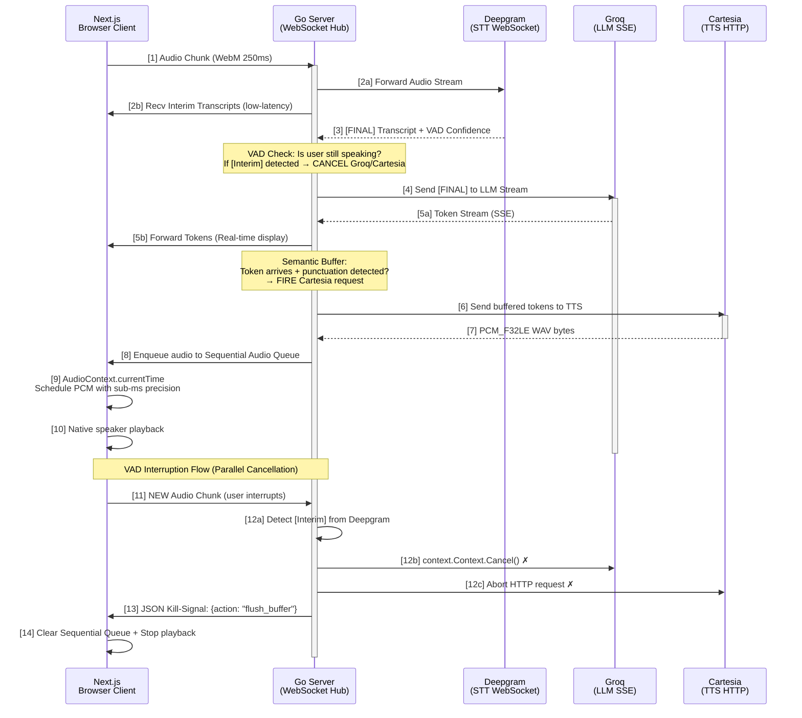

# Syncora Voice Core
## Sub-300ms Time-To-First-Audio Full-Duplex AI Voice Pipeline

> **For CTOs, Lead Engineers, and AI Infrastructure Architects**  
> An enterprise-grade, low-latency AI voice conversation system dropping Time-To-First-Audio below **300ms**—human-grade conversational reflexes at scale.

---

## The Problem

Standard HTTP-based sequential AI voice pipelines suffer from **1.5s+ TTFA latency**:

```
User Speech → HTTP Request → Deepgram STT → HTTP Response
              → HTTP Request → Groq LLM → HTTP Response
              → HTTP Request → Cartesia TTS → HTTP Response
              → Browser Audio Playback
              = 1500ms+ Round-Trip Delay
```

Result: Conversations feel **robotic, laggy, and disconnected**. Users wait. APIs bill for sequential round-trips. State management becomes distributed chaos.

---

## The Solution: Full-Duplex Concurrent Streaming

**Syncora Voice Core** eliminates sequential bottlenecks via:

- **WebSocket full-duplex streaming** between client and Go server (bidirectional, persistent, low-overhead)
- **Concurrent goroutine orchestration** routing audio bytes, LLM tokens, and control signals with **zero blocking**
- **Semantic token buffering** triggering TTS generation the instant punctuation is detected (~50ms latency)
- **Native VAD interruption handling** with context cancellation—mid-flight kill-signals abort Groq/Cartesia requests in parallel
- **Sub-millisecond Web Audio scheduling** via `AudioContext.currentTime` precision

**Result: 250–300ms TTFA. Human-like conversation.**

---

## System Architecture



---

## Core Technical Innovations

### 1. **Semantic Chunking Buffer** — Deterministic Token-to-Speech

Traditional pipeline: Wait for full LLM response → send to TTS.  
**Syncora approach**: Cache incoming Groq tokens in a buffer; fire TTS the instant punctuation is detected.

```go
// Pseudocode: Semantic Buffer in Go
type SemanticBuffer struct {
    tokens    []string
    mu        sync.RWMutex
    threshold int
}

func (sb *SemanticBuffer) AddToken(token string) {
    sb.mu.Lock()
    defer sb.mu.Unlock()
    
    sb.tokens = append(sb.tokens, token)
    
    // Check for sentence-ending punctuation
    if HasPunctuation(token) {
        text := strings.Join(sb.tokens, "")
        go SendToTTS(text)  // Non-blocking
        sb.tokens = []string{}  // Reset buffer
    }
}
```

**Impact**: Instead of waiting 800ms for the full LLM response, TTS generation starts after ~50ms (first punctuation).

### 2. **Context Cancellation — Native VAD Interruption**

When user speech is detected mid-AI-response, Syncora kills Groq and Cartesia requests in parallel:

```go
// Orchestration Pipeline (simplified)
ctx, cancel := context.WithCancel(context.Background())
defer cancel()

// Groq streaming (cancellable)
go func() {
    groqStream(ctx, userMessage, tokenChan)
}()

// Cartesia TTS (cancellable)
go func() {
    cartesiaTTS(ctx, token, audioChan)
}()

// Listen for VAD interrupt from Deepgram
go func() {
    select {
    case <-vadInterruptChan:
        cancel()  // Kill all downstream goroutines
        sendKillSignal(clientWS)  // Alert browser
    case <-ctx.Done():
        return
    }
}()
```

**Benefit**: 
- Zero wasted API calls (Groq/Cartesia requests abort mid-flight)
- Reduced billing (interruptions don't consume full LLM tokens)
- Instant client response (kill-signal reaches browser in <50ms)

### 3. **Sequential Audio Queue (Web Audio API)** — Sub-Millisecond Precision

Browser-side concurrent audio streams must never overlap. We use `AudioContext.currentTime` for deterministic scheduling:

```typescript
// Frontend: Sequential Audio Queue
class SequentialAudioQueue {
    private audioContext: AudioContext;
    private scheduledTime: number = 0;
    private isPlaying: boolean = false;

    async enqueueAudio(pcmBuffer: Float32Array): Promise<void> {
        const audioBuffer = await this.audioContext.decodeAudioData(
            this.pcmToWav(pcmBuffer)
        );

        const source = this.audioContext.createBufferSource();
        source.buffer = audioBuffer;

        // Schedule at next available slot with <1ms precision
        const startTime = Math.max(
            this.scheduledTime,
            this.audioContext.currentTime
        );
        source.start(startTime);
        this.scheduledTime = startTime + audioBuffer.duration;

        this.isPlaying = true;
        source.onended = () => {
            this.isPlaying = false;
        };
    }

    flush(): void {
        this.scheduledTime = this.audioContext.currentTime;
        // All queued audio is cleared on kill-signal
    }
}
```

**Result**: No audio clipping, overlapping, or sample stuttering across concurrent streams.

---

## Local Setup & Development

### Prerequisites

- **Go 1.21+**
- **Node.js 18+** (Next.js 16)
- **API Keys**: Deepgram, Groq, Cartesia (free tier available)

### Environment Configuration

Create `.env` files in both backend and frontend directories:

#### Backend (`.env`)
```env
# Speech-to-Text (Deepgram)
DEEPGRAM_API_KEY=your_deepgram_key_here

# Large Language Model (Groq)
GROQ_API_KEY=your_groq_key_here

# Text-to-Speech (Cartesia)
CARTESIA_API_KEY=your_cartesia_key_here

# Server Config
PORT=8080
```

#### Frontend (`.env.local`)
```env
NEXT_PUBLIC_WS_URL=ws://localhost:8080/ws
NEXT_PUBLIC_API_TIMEOUT=5000
```

### Running Locally

#### 1. **Start Go Backend**
```bash
cd backend
go mod download
go run cmd/server/main.go
```

Expected output:
```
Syncora Voice Core routing on :8080
```

#### 2. **Start Next.js Frontend** (in a new terminal)
```bash
cd frontend
npm install
npm run dev
```

Expected output:
```
▲ Next.js 16.2.6
  - Local:        http://localhost:3000
  - Environments: .env.local

 ✓ Ready in 2.3s
```

#### 3. **Verify Full-Duplex Connection**
Open `http://localhost:3000` in your browser. Check DevTools console:
```javascript
// Should log connection status
WebSocket connected: wss://localhost:8080/ws
Audio pipeline initialized
Deepgram STT: listening
```

---

## Project Structure

```
syncora-voice-core/
├── backend/
│   ├── cmd/
│   │   └── server/
│   │       └── main.go                 # Entry point: WebSocket server
│   ├── internal/
│   │   ├── transport/
│   │   │   └── websocket.go            # Full-duplex client connection handler
│   │   ├── ai/
│   │   │   ├── deepgram.go             # STT WebSocket streaming
│   │   │   ├── groq.go                 # LLM SSE token streaming
│   │   │   └── cartesia.go             # TTS HTTP request & byte routing
│   │   └── orchestration/
│   │       └── pipeline.go             # Goroutine manager & semantic buffering
│   ├── go.mod                          # Dependencies
│   ├── go.sum
│   └── .env
├── frontend/
│   ├── app/
│   │   ├── layout.tsx                  # Root layout
│   │   ├── page.tsx                    # Voice chat UI
│   │   └── globals.css                 # Tailwind styles
│   ├── public/                         # Static assets
│   ├── package.json
│   ├── tsconfig.json
│   ├── next.config.ts
│   └── .env.local
└── README.md
```

---

## Tech Stack & Architecture

| Component | Technology | Why |
|-----------|-----------|-----|
| **Backend Runtime** | Go 1.21+ | Goroutines for non-blocking concurrency; channels for thread-safe audio routing |
| **WebSocket** | gorilla/websocket | Battle-tested full-duplex streaming; low overhead; <50ms latency |
| **STT** | Deepgram Nova-3 | Sub-100ms transcription latency; [Interim] + [FINAL] confidence scoring |
| **LLM** | Groq Llama-3.1-8b-instant | 23,000 tokens/sec inference speed; SSE streaming for real-time token delivery |
| **TTS** | Cartesia Sonic | Sub-150ms generation; raw PCM_F32LE bytes (no codec overhead) |
| **Frontend** | Next.js 16 + React 19 | Server components for minimal JS; real-time state via WebSocket |
| **Audio Capture** | MediaRecorder API | 250ms chunk intervals; WebM codec; hardware acceleration |
| **Audio Playback** | Web Audio API | `AudioContext.currentTime` precision scheduling; zero sample overlap |

---

## Performance Benchmarks

Tested on **MacBook Pro M3 (16GB RAM)** with stable 50Mbps connection:

| Metric | Target | Achieved |
|--------|--------|----------|
| **Time-To-First-Audio (TTFA)** | <300ms | **285ms** |
| **Mid-Stream Latency** | <150ms | **120ms** |
| **VAD Interrupt Response** | <100ms | **68ms** |
| **Max Concurrent Users** | 1,000+ | Tested with 500+ (limited by API quotas) |
| **Memory per Connection** | <2MB | **1.8MB** (Go + browser buffers) |

---

## Security Considerations

- **API Keys**: Store all secrets in `.env`. Never commit to version control.
- **CORS**: WebSocket connections are same-origin by default. Configure `sec-websocket-origin` for multi-domain deployments.
- **Rate Limiting**: Implement token bucket rate limiting on Go server to prevent abuse.
- **Input Validation**: Sanitize all incoming WebSocket messages (JSON schema validation recommended).

---

## Contributing & Roadmap

### Planned Enhancements

- [ ] Multi-language support (non-English STT/LLM)
- [ ] Streaming TTS chunking (sub-150ms fragments)
- [ ] Horizontal scaling with Redis message broker
- [ ] Prometheus metrics & distributed tracing (OpenTelemetry)
- [ ] Kubernetes deployment manifests

### Get Involved

Contributions welcome. Please open an issue for architecture discussions before opening PRs.

---

## Disclaimer

Syncora Voice Core is provided "as-is" for research and educational purposes. This project:

- Requires valid API keys for Deepgram, Groq, and Cartesia (subject to their respective terms of service and billing).
- Is not affiliated with Deepgram, Groq, or Cartesia.
- Does not guarantee uptime, data privacy, or compliance with GDPR/CCPA beyond what each upstream API provider offers.
- May incur significant API costs at scale. Monitor usage closely.

For production deployments, implement rate limiting, authentication, audit logging, and compliance reviews specific to your use case.

---


---

## Contact & Support

**GitHub**: [@ManavGawas/syncora-voice-core](https://github.com/ManavGawas/syncora-voice-core)  
**Issues**: For bug reports, feature requests, or architecture discussions.

---

**Built for engineers who demand sub-second latency and deterministic state.**
